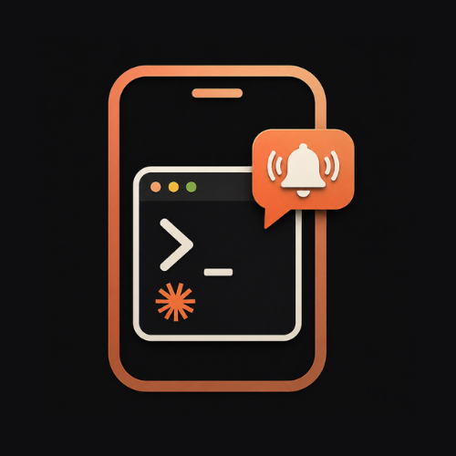

<p align="center">
  
</p>

# Claude Remote Runner

[](https://www.npmjs.com/package/@sohampawar1866/remote-claude)
[](https://opensource.org/licenses/MIT)

A cross-platform CLI wrapper and Progressive Web App (PWA) that lets you control [Claude Code](https://docs.anthropic.com/en/docs/agents-and-tools/claude-code/overview) remotely. Get push notifications on your phone whenever Claude pauses for input, approve or respond directly from your phone, and let your machine keep running.

## Features

- **Remote Control** - Get push notifications whenever Claude is paused (approval prompts, lint errors, etc.) and respond from your phone.
- **End-to-End Encryption** - All messages are encrypted with AES-256-GCM before leaving your machine. Nobody can read your prompts - not even the database host.
- **Cross-Platform Keep-Awake** - Prevents your Mac, Windows, or Linux machine from sleeping during long-running tasks.
- **Installable PWA** - A mobile frontend you can add to your home screen on iOS or Android for quick access.
- **Push Notifications via ntfy.sh** - Instant alerts with no setup or account needed.

## Installation

Install globally via npm:

```bash
npm install -g @sohampawar1866/remote-claude
```

## Usage

To start a remote session, simply run:

```bash
remote-claude
```

To keep your computer awake while Claude runs, use the `-k` flag:

```bash
remote-claude -k
```

On first launch, the CLI generates a secure URL. Open it on your phone to pair for that session.

## Architecture & Security

Security is a core concern for this tool. See the full **[Security Architecture Guide (SECURITY.md)](./SECURITY.md)** for details on the zero-trust model.

Here is how it works:

1. `remote-claude` wraps the `claude` CLI using `node-pty` and monitors terminal output.
2. When Claude pauses for input, the CLI generates a random `channelId` and AES `encryptionKey`.
3. The prompt is **encrypted locally** and synced to your [Appwrite](https://appwrite.io/) database.
4. A push notification is sent to your phone with a URL like: `https://remote-claude.shaniai.tech/?c=<channelId>&k=<encryptionKey>`.
5. You open the link, the PWA decrypts the prompt in the browser, you type a response, and it encrypts your reply before sending it back.

The `encryptionKey` is passed through the URL and never stored on the backend. Nobody - not even the database admin - can read your prompts.

## Project Structure

```
claude-remote-runner/
├── bin/                     # CLI entry point
│   └── remote-claude.js     # Main executable (node-pty wrapper)
├── docs/                    # Documentation and security logic
├── src/                     # CLI source modules
│   ├── config/              # Configuration logic
│   ├── services/            # Appwrite sync and Ntfy integration
│   └── utils/               # Crypto logic and keep-awake
├── mobile-app/              # Self-contained PWA (deploy separately)
│   ├── src/
│   │   ├── components/      # React UI components
│   │   ├── hooks/           # Custom React hooks
│   │   ├── services/        # Appwrite client + WebCrypto
│   │   └── App.jsx          # Root component
│   └── vercel.json          # Vercel deployment config
├── LICENSE
├── README.md
└── package.json
```

## Zero-Config Architecture

By default, Claude Remote Runner operates with a **Zero-Config** setup:
- The CLI points to a shared, hosted Appwrite backend.
- The mobile frontend is pre-deployed on Vercel.
- You can simply `npm install -g` and start using it immediately without configuring any environment variables or databases.

**Security**: All data is encrypted with AES-256-GCM *before* it leaves your machine. The hosted backend cannot read your prompts or responses. The database uses `Any` permissions to support zero-config sync, but because of the encryption, your data is mathematically secure and inaccessible to anyone without the key (which is only present in your terminal and mobile URL).

## Self-Hosting (Optional)

If you prefer total data sovereignty, you can deploy your own instance of the frontend and backend.

### 1. Self-Hosting the Frontend
1. Fork or clone this repository.
2. Deploy the `mobile-app` directory to Vercel or Netlify.
3. Set your new URL in your CLI's `.env` file:
   ```bash
   FRONTEND_URL=https://your-own-deployment.example.com
   ```

### 2. Self-Hosting the Backend (Appwrite)
1. Create a project on [Appwrite Cloud](https://cloud.appwrite.io/) or self-host via Docker.
2. Create a database (e.g. `remote_runner`).
3. Create a collection named `messages` with these attributes:
   - `sessionId` (String, size 255)
   - `type` (String, size 50)
   - `content` (String, size 1000000)
   - `timestamp` (Datetime)
4. Go to the Indexes tab and create two Key indexes:
   - `sessionId_index` on the `sessionId` attribute
   - `type_index` on the `type` attribute
5. Set collection permissions to **Any** (Create, Read, Update, Delete). This is safe because all data is E2E encrypted before it reaches the database.
6. Create `.env` files:

**CLI `.env`**:
```bash
APPWRITE_PROJECT_ID=your_project_id
APPWRITE_ENDPOINT=https://cloud.appwrite.io/v1
APPWRITE_DATABASE_ID=your_db_id
APPWRITE_COLLECTION_ID=your_collection_id
```

**Mobile App `.env`** (Vite requires the `VITE_` prefix):
```bash
VITE_APPWRITE_PROJECT_ID=your_project_id
VITE_APPWRITE_ENDPOINT=https://cloud.appwrite.io/v1
VITE_APPWRITE_DATABASE_ID=your_db_id
VITE_APPWRITE_COLLECTION_ID=your_collection_id
```

## Tech Stack

- **CLI Wrapper**: Node.js, `node-pty`, `strip-ansi`
- **Mobile App**: React, Vite, Pure CSS (Custom Design System), `vite-plugin-pwa`
- **Backend & Sync**: Appwrite (Serverless Database & Realtime API)
- **Push Notifications**: ntfy.sh
- **Encryption**: AES-256-GCM (Node.js `crypto` + Web Crypto API)

## Uninstallation

To completely remove the Claude Remote Runner and clear your local configuration, run the following commands:

```bash
remote-claude reset
npm uninstall -g @sohampawar1866/remote-claude
```

## Looking to Collaborate

Right now, Claude Remote Runner works by wrapping the CLI in a pseudo-terminal and parsing its output to detect when the agent is waiting for input. It works - but it is an external wrapper, not a native integration.

A direct integration inside an AI-powered IDE (like Cursor, Windsurf, or similar) would be a much better experience: instant pause detection, direct reply injection, and no setup for end users. The encryption layer, real-time sync, mobile PWA, and push notifications are all production-ready and transport-agnostic - they can plug into any agent framework, not just Claude Code.

**If you're building an AI-powered IDE or developer tool and want to offer remote mobile control as a built-in feature, feel free to open an issue or reach out.**

## License

MIT. See [LICENSE](./LICENSE).
